## Hello! I am Davis Liu,

I'm a second year Software Engineering student at the University of Waterloo. My interests include competitive programming, robotics, and mathematics.

### Find Me:
- https://davisliu2006.github.io
- davisliu2006@gmail.com
- https://dmoj.ca/user/DavisLiu

-----

    
    

